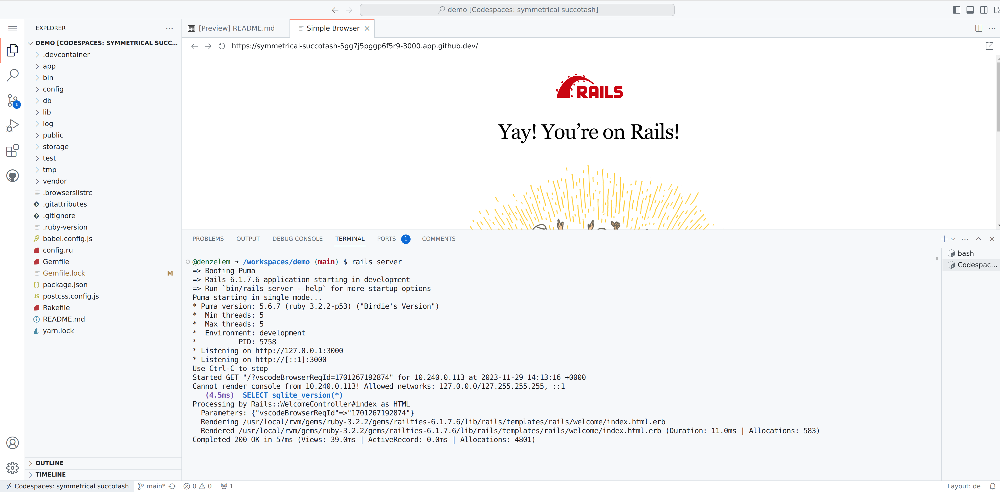

# Makandra Hackathon Demo

Welcome to the makandra hackathon demo repository. We assume that you finished all `MUST` items **before** the Hackathon. And hope you find time to accomplish the `MAY` items **before** the Hackathon, too. 

The demo repository is accessible by every participant and gives you a rough overview on how your setup will look like at the beginning of the hackathon. On the day of the hackathon we will follow roughly this timeline:

* After building teams, every team will be invited to a private repository with their Github account
* This repository (as any other team repository) will include a sample application similar to this demo application
* During the day you can submit you changes into your team repository together with your team members
* In the end of the day every teams shows its results and a winner team is chosen

Now, what's to do before the hackathon?

1. [`MUST`] You need to sign up for a Github Account or use an existing one. This is mandatory for the Hackathon since we are going to use [Github Codespaces](https://docs.github.com/en/codespaces/overview).
2. [`MAY`] If you have no experience with the Ruby programming language, we recommend to learn some Ruby in this [tutorial](https://try.ruby-lang.org/) (30 minutes).
3. [`MAY`] If you have no experience with the Ruby on Rails framework, we recommend to learn some Ruby on Rails in this [tutorial](https://www.youtube.com/playlist?list=PLm8ctt9NhMNV75T9WYIrA6m9I_uw7vS56) (> 4 hours). Use [your own codespace](https://codespaces.new/makandra-hackathon-2023/demo?quickstart=1) to skip all the setup steps in the tutorials. The IDE in Codespaces includes a terminal, git source control and a browser for previews of you application, so don't be confused about setup in the tutorial itself. Everything should work similar for you. Feel free to stop watching the playlist when things get too complicated and try to play around with the demo app yourself.

Example codespace:

